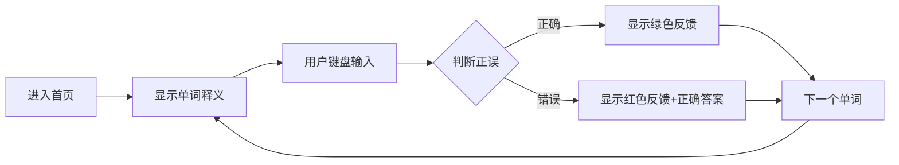

## 1. Product Overview
四级单词记忆网站是一款帮助用户高效记忆英语四级词汇的在线学习工具，通过键盘输入的方式强化单词记忆，支持手机端和电脑端访问。

## 2. Core Features

### 2.1 User Roles
| Role | Registration Method | Core Permissions |
|------|---------------------|------------------|
| User |无需注册|使用全部记忆功能|

### 2.2 Feature Module
1. **首页**: 单词记忆主界面，键盘输入练习
2. **单词列表**: 查看所有单词及释义
3. **学习统计**: 显示学习进度和成绩

### 2.3 Page Details
| Page Name | Module Name | Feature description |
|-----------|-------------|---------------------|
| 首页 | 单词展示区 | 显示单词、音标、释义 |
| 首页 | 输入区 | 用户键盘输入单词 |
| 首页 | 反馈区 | 显示正确/错误提示和答案 |
| 首页 | 进度条 | 显示当前学习进度 |
| 单词列表 | 列表展示 | 展示所有单词卡片 |
| 学习统计 | 统计图表 | 显示学习次数、正确率等 |

## 3. Core Process
用户进入首页 → 系统显示单词释义 → 用户通过键盘输入单词 → 系统判断正误 → 显示反馈 → 进入下一个单词

## 4. User Interface Design

### 4.1 Design Style
- Primary color: #6366f1 (靛蓝色)
- Secondary color: #8b5cf6 (紫色)
- Button style: rounded-full, gradient background
- Font: 'Inter', sans-serif
- Layout: card-based, centered
- Icons: lucide-react

### 4.2 Page Design Overview
| Page Name | Module Name | UI Elements |
|-----------|-------------|-------------|
| 首页 | 单词卡片 | 白色背景、圆角阴影、大字号单词显示 |
| 首页 | 输入框 | 居中、大尺寸、支持键盘聚焦 |
| 首页 | 反馈动画 | 正确时绿色闪烁，错误时红色抖动 |
| 首页 | 进度条 | 顶部横向进度条，渐变色 |

### 4.3 Responsiveness
- Mobile-first design
- Touch-friendly buttons
- Adaptive font sizes
- Layout adjusts based on screen size

### 4.4 3D Scene Guidance
不适用