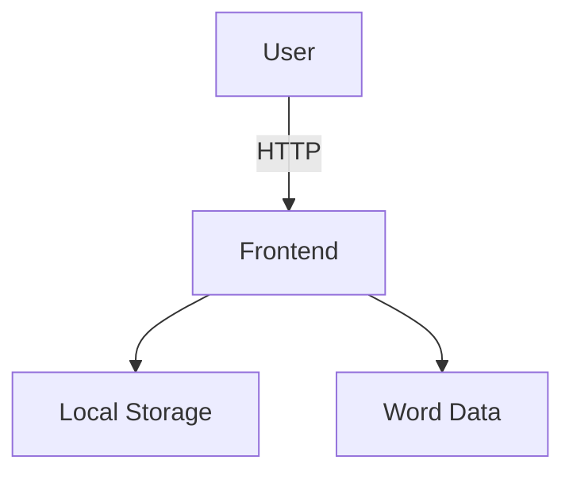
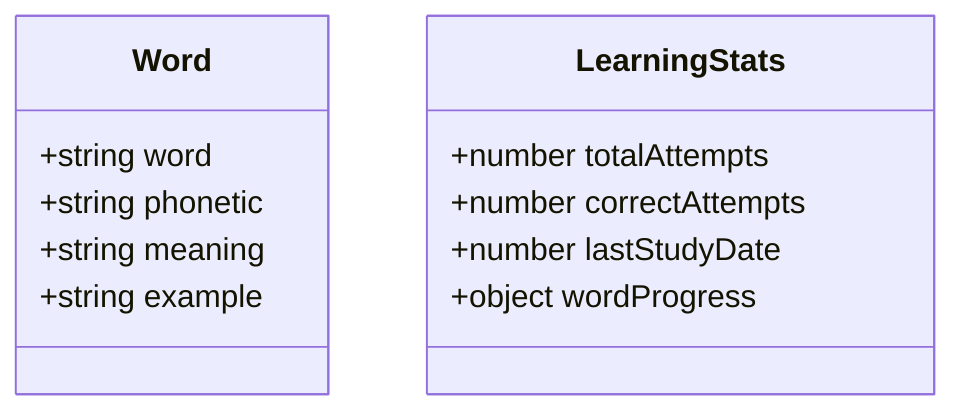

## 1. Architecture Design



## 2. Technology Description

* Frontend: React\@18 + tailwindcss\@3 + vite

* Initialization Tool: vite-init

* Backend: None (纯前端应用)

* Database: LocalStorage

## 3. Route Definitions

| Route  | Purpose      |
| ------ | ------------ |
| /      | 首页 - 单词记忆主界面 |
| /words | 单词列表页        |
| /stats | 学习统计页        |

## 4. API Definitions

无后端API，纯前端应用

## 5. Server Architecture Diagram

不适用

## 6. Data Model

### 6.1 Data Model Definition



### 6.2 Data Definition Language

**Word 数据结构:**

```typescript
interface Word {
  id: string;
  word: string;
  phonetic: string;
  meaning: string;
  example: string;
}
```

**LearningStats 数据结构:**

```typescript
interface LearningStats {
  totalAttempts: number;
  correctAttempts: number;
  lastStudyDate: string;
  wordProgress: Record<string, { correct: number; wrong: number }>;
}
```

**Mock 数据:**
包含约100
